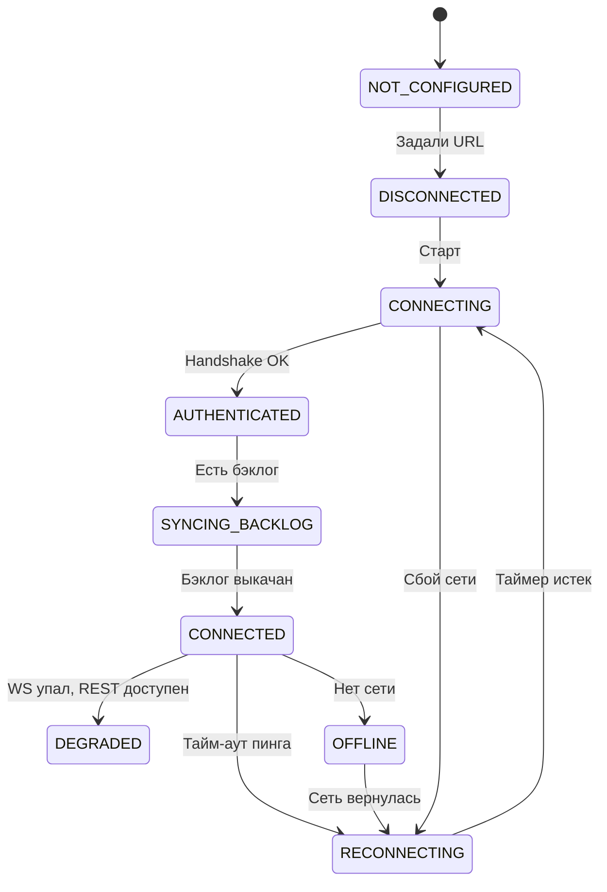

# 📡 Resilient Network Transport & SDK

<p align="left">
  <b>Русский</b> | <a href="README_EN.md">English</a>
</p>

[](wire_protocol_spec.md)
[](https://www.python.org/)
[](#license)
[](test_transport.py)

В мобильных сетях сокеты рвутся постоянно. Телефон переключился с Wi-Fi на LTE в лифте, приложение свернули в фон, сервер ушёл в ребут: без нормального транспорта сообщения теряются или дублируются, а клиенты затапливают бэкенд повторными подключениями.

Этот проект решает эту проблему. Внутри лежит готовая архитектура сетевого транспорта (Contract-First), клиентский SDK на Python и Mock-сервер с симулятором сетевых сбоев.

---

## 🌟 Что делает транспорт

- 🔒 **Не касается UI и шифрования:** Сетевой слой работает только с прозрачным конвертом `WireEnvelope` v1.0. Ему всё равно, что лежит внутри шифрованного пакета.
- 🔄 **Держит 9 четких состояний:** Автомат состояний (`ConnectionState`) исключает ситуативные баги: от `DISCONNECTED` до `SYNCING_BACKLOG` и `CONNECTED`.
- ⚡ **Делит задачи между REST и WebSocket:** Авторизация и загрузка истории идут по REST. Входящие сообщения, статусы доставки и keepalive транслируются через WebSocket.
- 📉 **Считает паузы по Exponential Backoff с Full Jitter:** При обрыве связь восстанавливается с рандомизированным нарастанием пауз. Сервер не упадёт от наплыва клиентов после сбоя.
- 📦 **Сохраняет сообщения в оффлайне:** Если сети нет, `PendingQueue` подержит сообщения локально и отправит их сразу после переподключения.
- 🆔 **Отсекает дубли по `client_request_id`:** Если сервер принял сообщение, но клиент не услышал ответ из-за обрыва, повторный запрос не создаст дубликат.
- 🩺 **Шлет Heartbeat каждые 15 секунд:** Если за 20 секунд ответ `pong` не пришел, клиент сам закроет «зависший» сокет и уйдёт в реконнект.
- 🧪 **Симулирует сбои:** Встроенный Mock-сервер на `aiohttp` умеет на ходу включать задержки, потерю пакетов и обрывы WebSocket.

---

## 📐 Автомат состояний клиента (State Machine)



---

## 📄 Документация и спецификации

- 📜 **[wire_protocol_spec.md](wire_protocol_spec.md)** - спецификация конверта `WireEnvelope` v1.0, фреймы `client_hello`, `server_hello`, `ack_event`, `ping/pong`.
- 🗺️ **[channel_map.md](channel_map.md)** - маршрутизация REST vs WebSocket и работа аварийного режима (Degraded Mode).
- 🔄 **[connection_lifecycle_spec.md](connection_lifecycle_spec.md)** - состояния подключения, тайминги Heartbeat и расчёт пауз реконнекта.
- 📬 **[delivery_and_offline_spec.md](delivery_and_offline_spec.md)** - пайплайн доставки (`accepted` -> `delivered` -> `read`), работа очереди и бэклога.
- 🧪 **[transport_qa_matrix.md](transport_qa_matrix.md)** - матрица проверочных сценариев.
- 📊 **[walkthrough.md](walkthrough.md)** - отчет о прохождении интеграционных тестов.

---

## 🛠 Структура файлов

```text
nexus/
├── mock_server/
│   └── server.py                 # Mock-сервер (REST + WS + эмулятор сбоев)
├── transport_sdk/
│   └── network_client.py         # Клиентский SDK транспорта
├── test_transport.py             # Интеграционные тесты
├── wire_protocol_spec.md         # Спецификация пакетов WireEnvelope
├── channel_map.md                # Карта маршрутов REST и WS
├── connection_lifecycle_spec.md  # Жизненный цикл и алгоритм реконнекта
├── delivery_and_offline_spec.md  # Описание оффлайн-очереди
├── transport_qa_matrix.md        # Чек-лист тестов
└── README.md                     # Документация проекта
```

---

## 🚀 Быстрый старт

### 1. Клонирование

```bash
git clone https://github.com/deadcipher/resilient-transport-architecture.git
cd resilient-transport-architecture
pip install aiohttp
```

### 2. Запуск тестов

Тест поднимает Mock-сервер в фоновом режиме, проверяет авторизацию, отправку сообщений, симулирует оффлайн и проверяет авто-сброс очереди:

```bash
python test_transport.py
```

Успешный прогон:

```text
[INFO] === STARTING INTEGRATION TESTS FOR TRANSPORT LAYER ===
[INFO] Mock Server running on http://127.0.0.1:8088
[INFO] TEST 1 PASSED: REST Login successful.
[INFO] TEST 2 PASSED: Client is in CONNECTED state.
[INFO] TEST 3 PASSED: ACKs received successfully: ['accepted', 'delivered']
[INFO] TEST 4 PASSED: PendingQueue successfully flushed and cleared.
[INFO] TEST 5 PASSED: Client stopped cleanly.
==================================================
ALL INTEGRATION TESTS PASSED SUCCESSFULLY! (5/5)
==================================================
```

---

## 💻 Пример использования SDK в коде

```python
import asyncio
from transport_sdk.network_client import NetworkClient

async def main():
    client = NetworkClient(
        base_url="http://127.0.0.1:8080",
        ws_url="http://127.0.0.1:8080",
        device_id="my_device"
    )

    client.on_state_change = lambda old, new: print(f"Состояние: {old.value} -> {new.value}")
    client.on_ack_received = lambda ack: print(f"Статус доставки: {ack['payload']['status']}")
    client.on_message_received = lambda msg: print(f"Входящее: {msg}")

    await client.login(username="alice")
    await client.start()

    await client.send_message(
        conversation_id="chat_42",
        payload={"text": "Привет!"},
        payload_mode="plain_json"
    )

if __name__ == "__main__":
    asyncio.run(main())
```

---

## 📜 Лицензия

Проект распространяется по лицензии [MIT](LICENSE).
