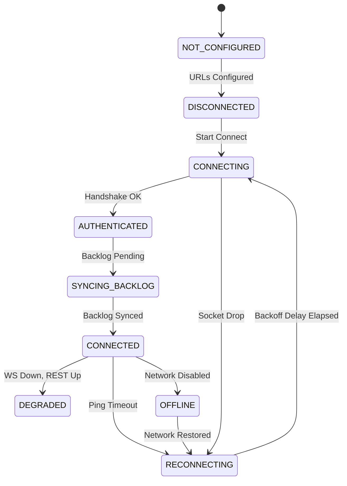

# 📡 Resilient Network Transport & SDK

<p align="left">
  <b>English</b> | <a href="README.md">Русский</a>
</p>

[](wire_protocol_spec.md)
[](https://www.python.org/)
[](#license)
[](test_transport.py)

In mobile networks, sockets drop constantly. Phones switch from Wi-Fi to LTE in elevators, apps get backgrounded, and servers restart. Without proper network transport, messages get lost or duplicated, and reconnecting clients flood the backend.

This project solves this problem. It provides a production-grade Contract-First network transport architecture, a Python client SDK, and a Mock Server with a network anomaly simulator (Chaos Engineering).

---

## 🌟 Features & Highlights

- 🔒 **Decoupled from UI & E2E Crypto:** The network transport layer operates purely with transparent `WireEnvelope` v1.0 wrappers without interfering with chat domain logic or payload encryption.
- 🔄 **Strict 9-State Client State Machine:** Prevents edge-case bugs by tracking state explicitly from `DISCONNECTED` to `SYNCING_BACKLOG` and `CONNECTED`.
- ⚡ **REST + WebSocket Channel Split:** Auth and history sync run over REST, while live incoming messages, ACKs, and keepalive pings travel via WebSockets.
- 📉 **Exponential Backoff with Full Jitter:** Randomized reconnect delay scaling prevents Thundering Herd issues when recovering from server outages.
- 📦 **Offline Pending Queue:** No internet? Outgoing messages are cached locally and flushed automatically once reconnected.
- 🆔 **Idempotent Deduplication:** Uses unique `client_request_id` values so retry requests never create duplicate messages on the server.
- 🩺 **Heartbeat Keepalive:** Sends ping/pong frames every 15s with a 20s hard timeout to catch ghost/broken TCP sockets.
- 🧪 **Chaos Mock Server:** Built-in `aiohttp` server capable of simulating latency, packet loss, and socket drops on the fly.

---

## 📐 Client Connection State Machine



---

## 📄 Specs & Documentation

- 📜 **[wire_protocol_spec.md](wire_protocol_spec.md)** - `WireEnvelope` v1.0 format, `client_hello`, `server_hello`, `ack_event`, `ping/pong` frames.
- 🗺️ **[channel_map.md](channel_map.md)** - REST vs WebSocket route mapping and Degraded Fallback mode.
- 🔄 **[connection_lifecycle_spec.md](connection_lifecycle_spec.md)** - State Machine specs, Heartbeat timings, and Backoff formula.
- 📬 **[delivery_and_offline_spec.md](delivery_and_offline_spec.md)** - Message delivery flow (`accepted` -> `delivered` -> `read`), queueing, and backlog sync.
- 🧪 **[transport_qa_matrix.md](transport_qa_matrix.md)** - QA matrix of 12+ test scenarios.
- 📊 **[walkthrough.md](walkthrough.md)** - Integration test run report.

---

## 🛠 Project Structure

```text
nexus/
├── mock_server/
│   └── server.py                 # Mock Server (REST + WS + Chaos Flags)
├── transport_sdk/
│   └── network_client.py         # Client Transport SDK
├── test_transport.py             # Integration Test Suite
├── wire_protocol_spec.md         # WireEnvelope Specs
├── channel_map.md                # REST & WS Route Map
├── connection_lifecycle_spec.md  # Connection Lifecycle & Backoff
├── delivery_and_offline_spec.md  # Offline Queue & Delivery Specs
├── transport_qa_matrix.md        # QA Checklist
├── README.md                     # Documentation (Russian)
└── README_EN.md                  # Documentation (English)
```

---

## 🚀 Quick Start

### 1. Installation

```bash
git clone https://github.com/deadcipher/resilient-transport-architecture.git
cd resilient-transport-architecture
pip install aiohttp
```

### 2. Run Tests

The test runner starts the Mock Server in a background task, performs authentication, tests live WS send, simulates offline state, and verifies automatic queue flushing:

```bash
python test_transport.py
```

Expected output:

```text
[INFO] === STARTING INTEGRATION TESTS FOR TRANSPORT LAYER ===
[INFO] Mock Server running on http://127.0.0.1:8088
[INFO] TEST 1 PASSED: REST Login successful.
[INFO] TEST 2 PASSED: Client is in CONNECTED state.
[INFO] TEST 3 PASSED: ACKs received successfully: ['accepted', 'delivered']
[INFO] TEST 4 PASSED: PendingQueue successfully flushed and cleared.
[INFO] TEST 5 PASSED: Client stopped cleanly.
==================================================
ALL INTEGRATION TESTS PASSED SUCCESSFULLY! (5/5)
==================================================
```

---

## 💻 SDK Usage Example

```python
import asyncio
from transport_sdk.network_client import NetworkClient

async def main():
    client = NetworkClient(
        base_url="http://127.0.0.1:8080",
        ws_url="http://127.0.0.1:8080",
        device_id="my_device"
    )

    client.on_state_change = lambda old, new: print(f"State: {old.value} -> {new.value}")
    client.on_ack_received = lambda ack: print(f"Delivery ACK: {ack['payload']['status']}")
    client.on_message_received = lambda msg: print(f"Incoming: {msg}")

    await client.login(username="alice")
    await client.start()

    await client.send_message(
        conversation_id="chat_42",
        payload={"text": "Hello World!"},
        payload_mode="plain_json"
    )

if __name__ == "__main__":
    asyncio.run(main())
```

---

## 📜 License

[MIT](LICENSE) - Feel free to use in your own projects.
