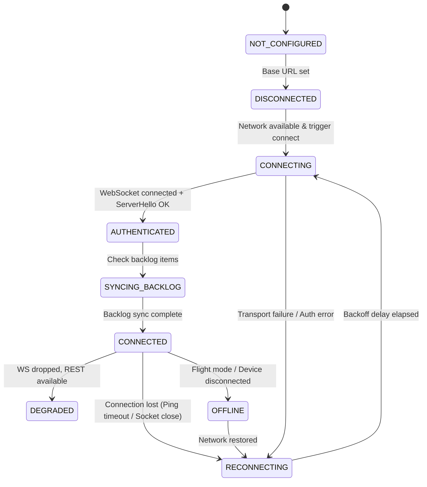

# Connection Lifecycle & Resilience Specification

Данный документ содержит полное описание конечного автомата состояний подключения (`Client Network State Machine`), а также спецификацию алгоритма повторных подключений (Reconnect Backoff) и мониторинга разрывов (Heartbeat).

---

## 1. Client Network State Machine

Клиентский сетевой модуль находится строго в одном из 9 состояний:

### Таблица состояний

| Состояние | Описание | Разрешенные операции |
| :--- | :--- | :--- |
| `NOT_CONFIGURED` | Не заданы URL сервера или параметры клиента | Изменение настроек |
| `DISCONNECTED` | Сетевой модуль остановлен вручную или токен отсутствует | Запуск подключения, Auth login |
| `CONNECTING` | Установка TCP/TLS соединения и проведение WS Handshake | Чтение состояния |
| `AUTHENTICATED` | WS Handshake прошел успешно (`ServerHello` получен) | Отправка `client_hello`, чтение информации о сессии |
| `SYNCING_BACKLOG` | Запрос и получение пропущенных сообщений из оффлайна | Чтение бэклога |
| `CONNECTED` | Стабильное полнодуплексное соединение в штатном режиме | Все операции (Send, Push, ACK, Ping) |
| `DEGRADED` | WS недоступен, но REST доступен | Send via REST, Polling |
| `RECONNECTING` | Ожидание паузы Backoff перед следующей попыткой подключения | Чтение очереди, сохранение черновиков |
| `OFFLINE` | Сетевой интерфейс устройства выключен | Локальное сохранение в `PendingQueue` |

---

## 2. Reconnect Strategy: Exponential Backoff + Full Jitter

При обрыве связи или неуспешной попытке подключения повторные попытки выполняются строго по алгоритму **Exponential Backoff с Full Jitter** для предотвращения «громоподобного стада» (Thundering Herd Problem) при падении сервера.

### Формула расчёта паузы:

$$\text{Temp} = \min(T_{\text{max}}, T_{\text{base}} \times 2^{\text{attempt}})$$
$$\text{Delay} = \text{random\_uniform}(0, \text{Temp})$$

### Параметры алгоритма:
- $T_{\text{base}} = 1.0$ секунда (базовый интервал)
- $T_{\text{max}} = 30.0$ секунд (максимальный интервал)
- $\text{Max Attempts} = \infty$ (бесконечно в фоне с ограничением $T_{\text{max}}$)

---

## 3. Heartbeat & Keepalive Protocol

Детектирование «тихих» обрывов (когда сокет открыт, но трафик не идет) осуществляется с помощью периодических фреймов `ping` / `pong`.

1. **Интервал отправки:** Каждые **15 секунд** клиент отправляет `ping`.
2. **Soft Timeout (10 секунд):** Если за 10 секунд ответ `pong` не получен, клиент переходит в режим повышенного внимания.
3. **Hard Timeout (20 секунд):** Если за 20 секунд ответ `pong` так и не пришел, клиент принудительно закрывает сокет (`socket.close()`) и мгновенно переходит в состояние `RECONNECTING`.
